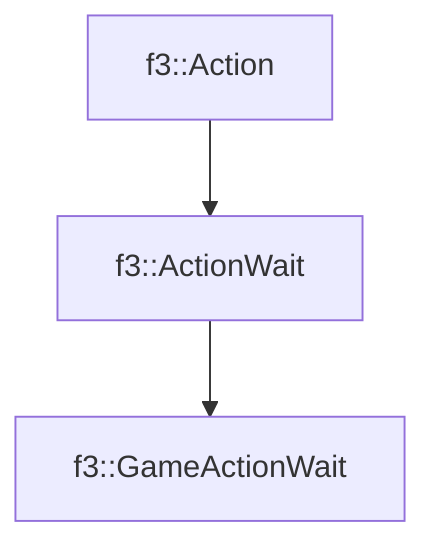

# f3::GameActionWait

[Return to `f3`](/docs/f3.md)

## C++

- [`GameActionWait.hpp`](/c++/include/GameActionWait.hpp)
- [`GameActionWait.cpp`](/c++/source/GameActionWait.cpp)

## References

- [`f3::Action`](/docs/f3/Action.md)
- [`f3::ActionWait`](/docs/f3/ActionWait.md)

## Inheritance

[Return to `f3`](/docs/f3.md)