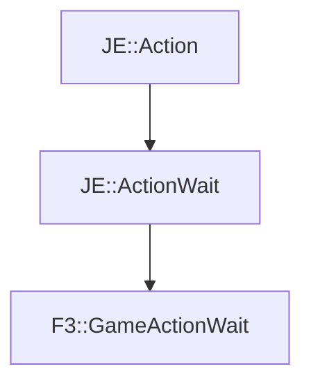

# F3::GameActionWait

[Return to `F3`](/docs/f3.md)

## C++

- [`GameActionWait.hpp`](/src/f3/GameActionWait.hpp)
- [`GameActionWait.cpp`](/src/f3/GameActionWait.cpp)

## References

- [`JE::Action`](https://github.com/OpenJE/openje/docs/je/Action.md)
- [`JE::ActionWait`](https://github.com/OpenJE/openje/docs/je/ActionWait.md)

## Inheritance

[Return to `F3`](/docs/f3.md)