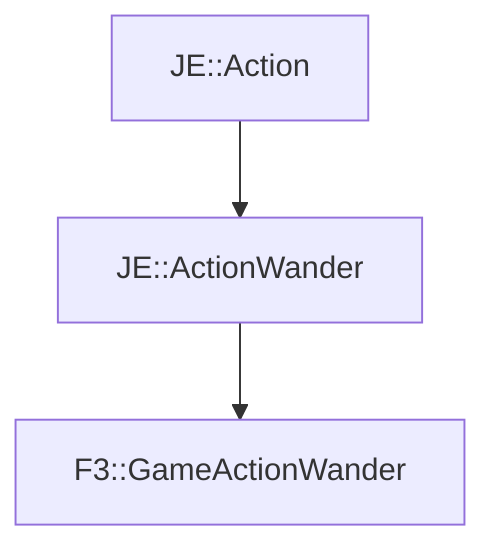

# F3::GameActionWander

[Return to `F3`](/docs/f3.md)

## C++

- [`GameActionWander.hpp`](/src/f3/GameActionWander.hpp)
- [`GameActionWander.cpp`](/src/f3/GameActionWander.cpp)

## References

- [`JE::Action`](https://github.com/OpenJE/openje/docs/je/Action.md)
- [`JE::ActionWander`](https://github.com/OpenJE/openje/docs/je/ActionWander.md)

## Inheritance

[Return to `F3`](/docs/f3.md)