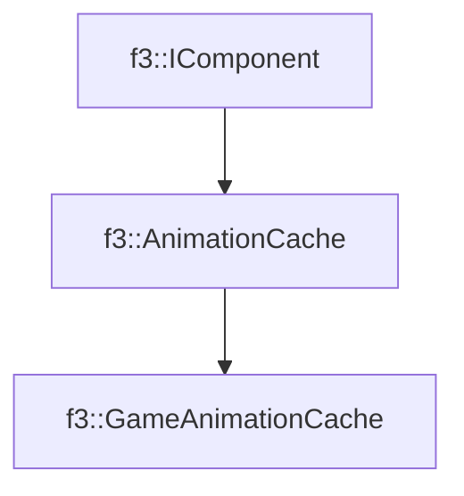

# f3::GameAnimationCache

[Return to `f3`](/docs/f3.md)

## C++

- [`GameAnimationCache.hpp`](/src/f3/GameAnimationCache.hpp)
- [`GameAnimationCache.cpp`](/src/f3/GameAnimationCache.cpp)

## References

- [`f3::IComponent`](/docs/f3/IComponent.md)
- [`f3::AnimationCache`](/docs/f3/AnimationCache.md)

## Inheritance

[Return to `f3`](/docs/f3.md)