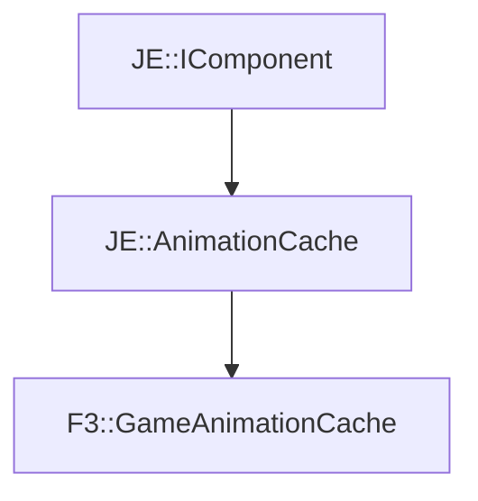

# F3::GameAnimationCache

[Return to `F3`](/docs/f3.md)

## C++

- [`GameAnimationCache.hpp`](/src/f3/GameAnimationCache.hpp)
- [`GameAnimationCache.cpp`](/src/f3/GameAnimationCache.cpp)

## References

- [`JE::IComponent`](https://github.com/OpenJE/openje/docs/je/IComponent.md)
- [`JE::AnimationCache`](https://github.com/OpenJE/openje/docs/je/AnimationCache.md)

## Inheritance

[Return to `F3`](/docs/f3.md)