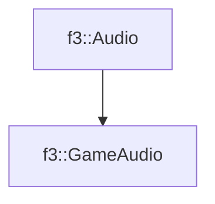

# f3::GameAudio

[Return to `f3`](/docs/f3.md)

## C++

- [`GameAudio.hpp`](/c++/include/GameAudio.hpp)
- [`GameAudio.cpp`](/c++/source/GameAudio.cpp)

## References

- [`f3::Audio`](/docs/f3/Audio.md)

## Inheritance

[Return to `f3`](/docs/f3.md)