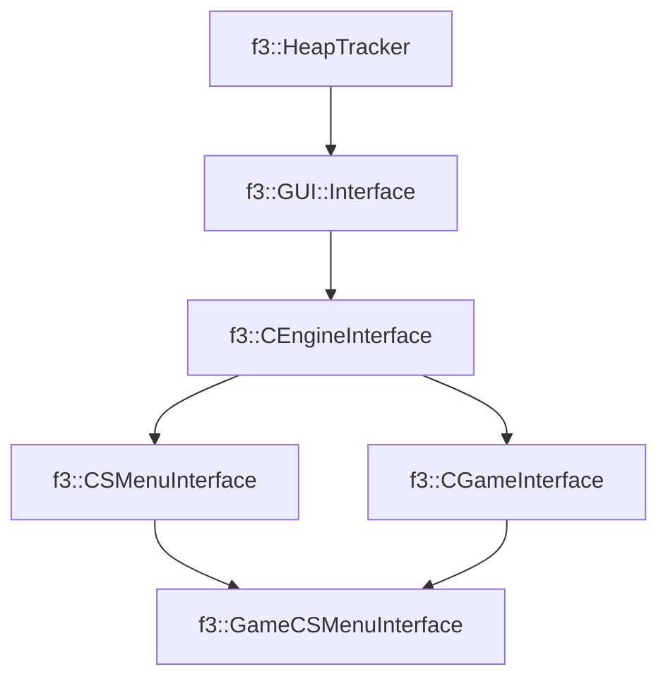

# f3::GameCSMenuInterface

[Return to `f3`](/docs/f3.md)

## C++

- [`GameCSMenuInterface.hpp`](/c++/include/GameCSMenuInterface.hpp)
- [`GameCSMenuInterface.cpp`](/c++/source/GameCSMenuInterface.cpp)

## References

- [`f3::HeapTracker`](/docs/f3/HeapTracker.md)
- [`f3::GUI::Interface`](/docs/f3/GUI/Interface.md)
- [`f3::CEngineInterface`](/docs/f3/CEngineInterface.md)
- [`f3::CSMenuInterface`](/docs/f3/CSMenuInterface.md)
- [`f3::CGameInterface`](/docs/f3/CGameInterface.md)

## Inheritance

[Return to `f3`](/docs/f3.md)