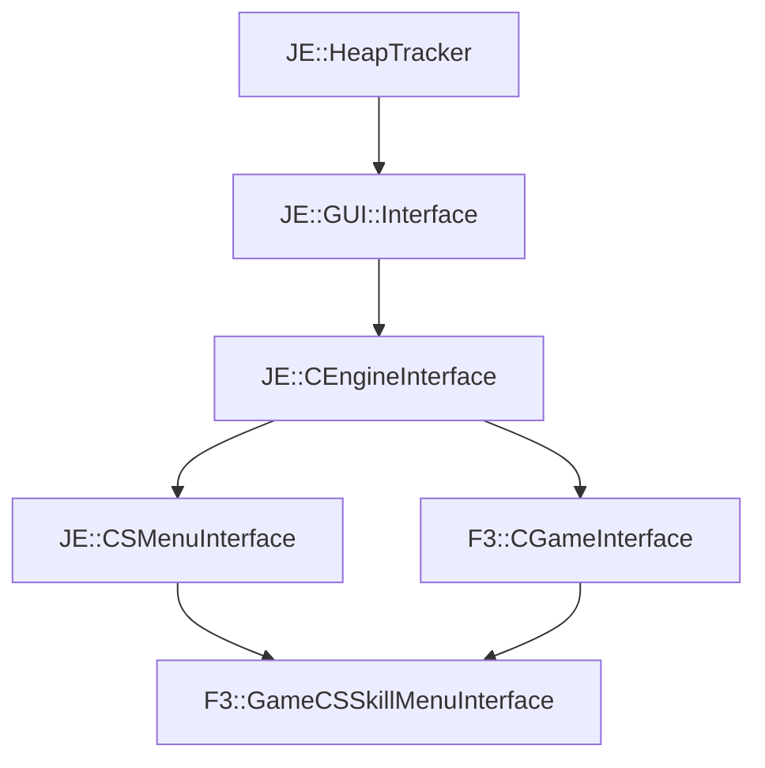

# F3::GameCSSkillMenuInterface

[Return to `F3`](/docs/f3.md)

## C++

- [`GameCSSkillMenuInterface.hpp`](/src/f3/GameCSSkillMenuInterface.hpp)
- [`GameCSSkillMenuInterface.cpp`](/src/f3/GameCSSkillMenuInterface.cpp)

## References

- [`JE::HeapTracker`](https://github.com/OpenJE/openje/docs/je/HeapTracker.md)
- [`JE::GUI::Interface`](https://github.com/OpenJE/openje/docs/je/GUI/Interface.md)
- [`JE::CEngineInterface`](https://github.com/OpenJE/openje/docs/je/CEngineInterface.md)
- [`JE::CSMenuInterface`](https://github.com/OpenJE/openje/docs/je/CSMenuInterface.md)
- [`F3::CGameInterface`](/docs/f3/CGameInterface.md)

## Inheritance

[Return to `F3`](/docs/f3.md)