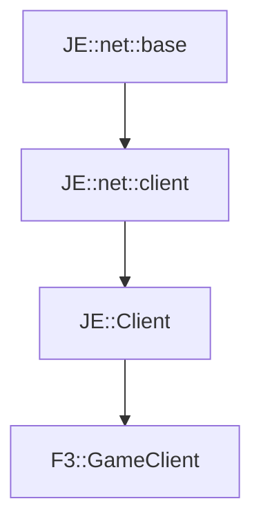

# F3::GameClient

[Return to `F3`](/docs/f3.md)

## C++

- [`GameClient.hpp`](/src/f3/GameClient.hpp)
- [`GameClient.cpp`](/src/f3/GameClient.cpp)

## References

- [`JE::net::base`](https://github.com/OpenJE/openje/docs/je/net/base.md)
- [`JE::net::client`](https://github.com/OpenJE/openje/docs/je/net/client.md)
- [`JE::Client`](https://github.com/OpenJE/openje/docs/je/Client.md)

## Inheritance

[Return to `F3`](/docs/f3.md)