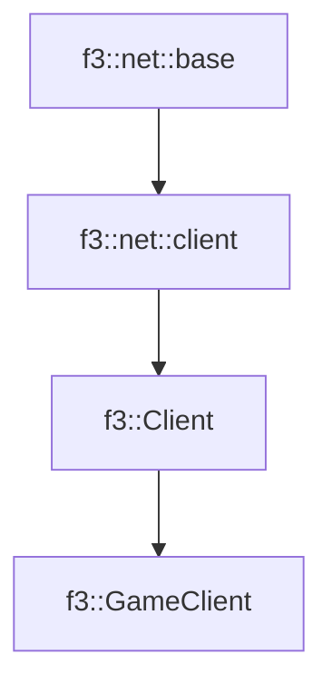

# f3::GameClient

[Return to `f3`](/docs/f3.md)

## C++

- [`GameClient.hpp`](/src/f3/GameClient.hpp)
- [`GameClient.cpp`](/src/f3/GameClient.cpp)

## References

- [`f3::net::base`](/docs/net/base.md)
- [`f3::net::client`](/docs/net/client.md)
- [`f3::Client`](/docs/f3/Client.md)

## Inheritance

[Return to `f3`](/docs/f3.md)