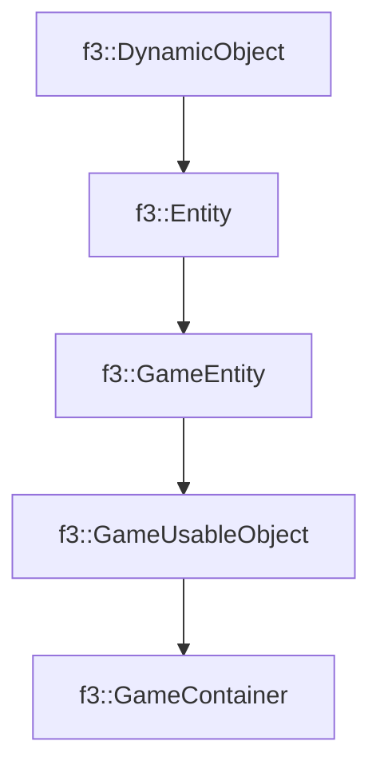

# f3::GameContainer

[Return to `f3`](/docs/f3.md)

## C++

- [`GameContainer.hpp`](/src/f3/GameContainer.hpp)
- [`GameContainer.cpp`](/src/f3/GameContainer.cpp)

## References

- [`f3::DynamicObject`](/docs/f3/DynamicObject.md)
- [`f3::Entity`](/docs/f3/Entity.md)
- [`f3::GameEntity`](/docs/f3/GameEntity.md)
- [`f3::GameUsableObject`](/docs/f3/GameUsableObject.md)

## Inheritance

[Return to `f3`](/docs/f3.md)