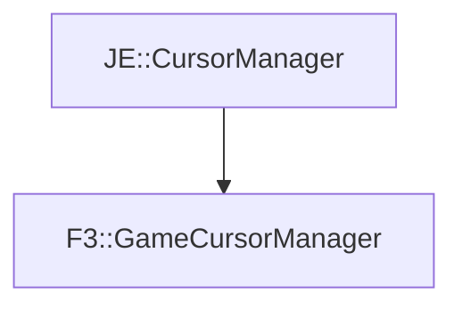

# F3::GameCursorManager

[Return to `F3`](/docs/f3.md)

## C++

- [`GameCursorManager.hpp`](/src/f3/GameCursorManager.hpp)
- [`GameCursorManager.cpp`](/src/f3/GameCursorManager.cpp)

## References

- [`JE::CursorManager`](https://github.com/OpenJE/openje/docs/je/CursorManager.md)

## Inheritance

[Return to `F3`](/docs/f3.md)