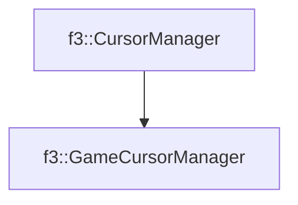

# f3::GameCursorManager

[Return to `f3`](/docs/f3.md)

## C++

- [`GameCursorManager.hpp`](/src/f3/GameCursorManager.hpp)
- [`GameCursorManager.cpp`](/src/f3/GameCursorManager.cpp)

## References

- [`f3::CursorManager`](/docs/f3/CursorManager.md)

## Inheritance

[Return to `f3`](/docs/f3.md)