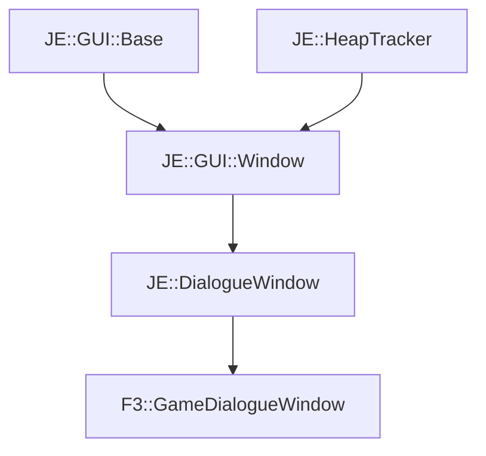

# F3::GameDialogueWindow

[Return to `F3`](/docs/f3.md)

## C++

- [`GameDialogueWindow.hpp`](/src/f3/GameDialogueWindow.hpp)
- [`GameDialogueWindow.cpp`](/src/f3/GameDialogueWindow.cpp)

## References

- [`JE::GUI::Base`](https://github.com/OpenJE/openje/docs/je/GUI/Base.md)
- [`JE::HeapTracker`](https://github.com/OpenJE/openje/docs/je/HeapTracker.md)
- [`JE::GUI::Window`](https://github.com/OpenJE/openje/docs/je/GUI/Window.md)
- [`JE::DialogueWindow`](https://github.com/OpenJE/openje/docs/je/DialogueWindow.md)

## Inheritance

[Return to `F3`](/docs/f3.md)