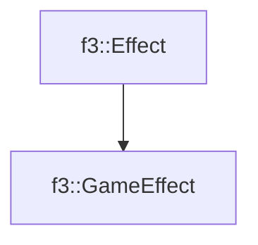

# f3::GameEffect

[Return to `f3`](/docs/f3.md)

## C++

- [`GameEffect.hpp`](/src/f3/GameEffect.hpp)
- [`GameEffect.cpp`](/src/f3/GameEffect.cpp)

## References

- [`f3::Effect`](/docs/f3/Effect.md)

## Inheritance

[Return to `f3`](/docs/f3.md)