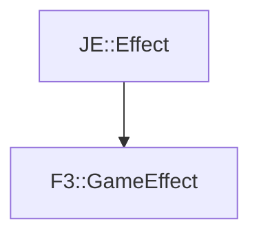

# F3::GameEffect

[Return to `F3`](/docs/f3.md)

## C++

- [`GameEffect.hpp`](/src/f3/GameEffect.hpp)
- [`GameEffect.cpp`](/src/f3/GameEffect.cpp)

## References

- [`JE::Effect`](https://github.com/OpenJE/openje/docs/je/Effect.md)

## Inheritance

[Return to `F3`](/docs/f3.md)