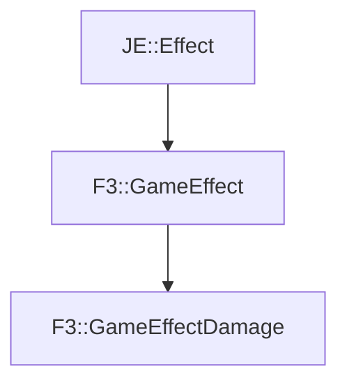

# F3::GameEffectDamage

[Return to `F3`](/docs/f3.md)

## C++

- [`GameEffectDamage.hpp`](/src/f3/GameEffectDamage.hpp)
- [`GameEffectDamage.cpp`](/src/f3/GameEffectDamage.cpp)

## References

- [`JE::Effect`](https://github.com/OpenJE/openje/docs/je/Effect.md)
- [`F3::GameEffect`](/docs/f3/GameEffect.md)

## Inheritance

[Return to `F3`](/docs/f3.md)