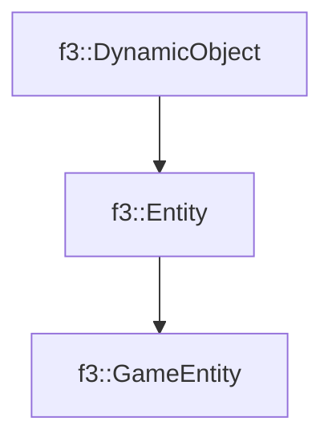

# f3::GameEntity

[Return to `f3`](/docs/f3.md)

## C++

- [`GameEntity.hpp`](/c++/include/GameEntity.hpp)
- [`GameEntity.cpp`](/c++/source/GameEntity.cpp)

## References

- [`f3::DynamicObject`](/docs/f3/DynamicObject.md)
- [`f3::Entity`](/docs/f3/Entity.md)

## Inheritance

[Return to `f3`](/docs/f3.md)