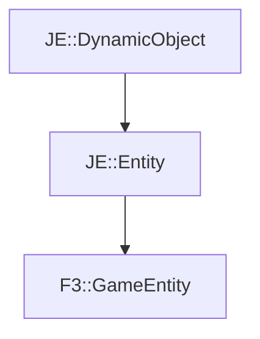

# F3::GameEntity

[Return to `F3`](/docs/f3.md)

## C++

- [`GameEntity.hpp`](/src/f3/GameEntity.hpp)
- [`GameEntity.cpp`](/src/f3/GameEntity.cpp)

## References

- [`JE::DynamicObject`](https://github.com/OpenJE/openje/docs/je/DynamicObject.md)
- [`JE::Entity`](https://github.com/OpenJE/openje/docs/je/Entity.md)

## Inheritance

[Return to `F3`](/docs/f3.md)