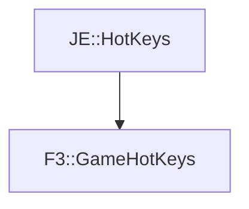

# F3::GameHotKeys

[Return to `F3`](/docs/f3.md)

## C++

- [`GameHotKeys.hpp`](/src/f3/GameHotKeys.hpp)
- [`GameHotKeys.cpp`](/src/f3/GameHotKeys.cpp)

## References

- [`JE::HotKeys`](https://github.com/OpenJE/openje/docs/je/HotKeys.md)

## Inheritance

[Return to `F3`](/docs/f3.md)