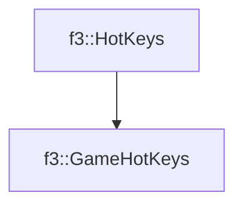

# f3::GameHotKeys

[Return to `f3`](/docs/f3.md)

## C++

- [`GameHotKeys.hpp`](/c++/include/GameHotKeys.hpp)
- [`GameHotKeys.cpp`](/c++/source/GameHotKeys.cpp)

## References

- [`f3::HotKeys`](/docs/f3/HotKeys.md)

## Inheritance

[Return to `f3`](/docs/f3.md)