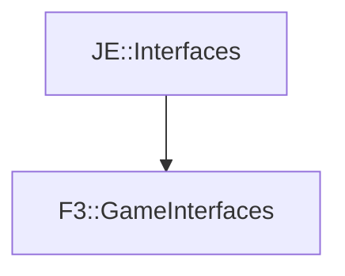

# F3::GameInterfaces

[Return to `F3`](/docs/f3.md)

## C++

- [`GameInterfaces.hpp`](/src/f3/GameInterfaces.hpp)
- [`GameInterfaces.cpp`](/src/f3/GameInterfaces.cpp)

## References

- [`JE::Interfaces`](https://github.com/OpenJE/openje/docs/je/Interfaces.md)

## Inheritance

[Return to `F3`](/docs/f3.md)