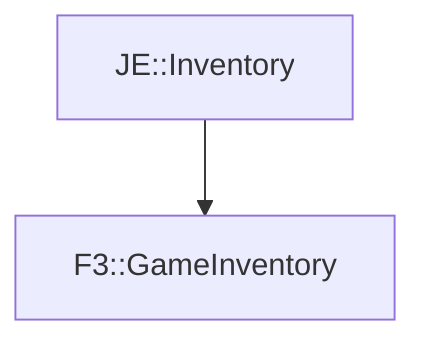

# F3::GameInventory

[Return to `F3`](/docs/f3.md)

## C++

- [`GameInventory.hpp`](/src/f3/GameInventory.hpp)
- [`GameInventory.cpp`](/src/f3/GameInventory.cpp)

## References

- [`JE::Inventory`](https://github.com/OpenJE/openje/docs/je/Inventory.md)

## Inheritance

[Return to `F3`](/docs/f3.md)