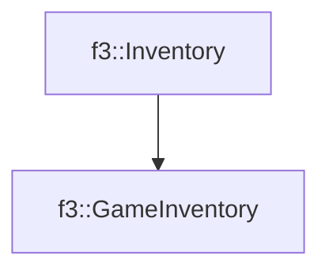

# f3::GameInventory

[Return to `f3`](/docs/f3.md)

## C++

- [`GameInventory.hpp`](/c++/include/GameInventory.hpp)
- [`GameInventory.cpp`](/c++/source/GameInventory.cpp)

## References

- [`f3::Inventory`](/docs/f3/Inventory.md)

## Inheritance

[Return to `f3`](/docs/f3.md)