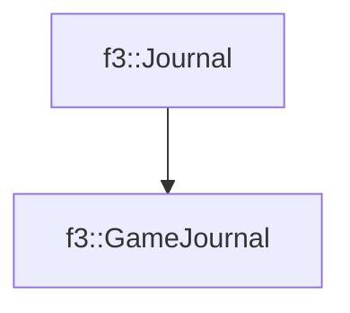

# f3::GameJournal

[Return to `f3`](/docs/f3.md)

## C++

- [`GameJournal.hpp`](/src/f3/GameJournal.hpp)
- [`GameJournal.cpp`](/src/f3/GameJournal.cpp)

## References

- [`f3::Journal`](/docs/f3/Journal.md)

## Inheritance

[Return to `f3`](/docs/f3.md)