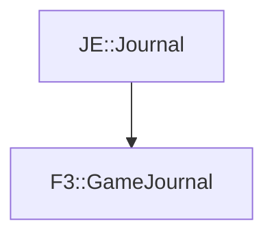

# F3::GameJournal

[Return to `F3`](/docs/f3.md)

## C++

- [`GameJournal.hpp`](/src/f3/GameJournal.hpp)
- [`GameJournal.cpp`](/src/f3/GameJournal.cpp)

## References

- [`JE::Journal`](https://github.com/OpenJE/openje/docs/je/Journal.md)

## Inheritance

[Return to `F3`](/docs/f3.md)