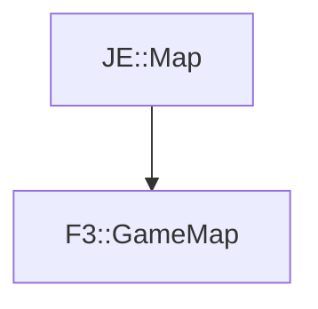

# F3::GameMap

[Return to `F3`](/docs/f3.md)

## C++

- [`GameMap.hpp`](/src/f3/GameMap.hpp)
- [`GameMap.cpp`](/src/f3/GameMap.cpp)

## References

- [`JE::Map`](https://github.com/OpenJE/openje/docs/je/Map.md)

## Inheritance

[Return to `F3`](/docs/f3.md)