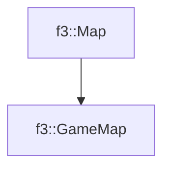

# f3::GameMap

[Return to `f3`](/docs/f3.md)

## C++

- [`GameMap.hpp`](/c++/include/GameMap.hpp)
- [`GameMap.cpp`](/c++/source/GameMap.cpp)

## References

- [`f3::Map`](/docs/f3/Map.md)

## Inheritance

[Return to `f3`](/docs/f3.md)