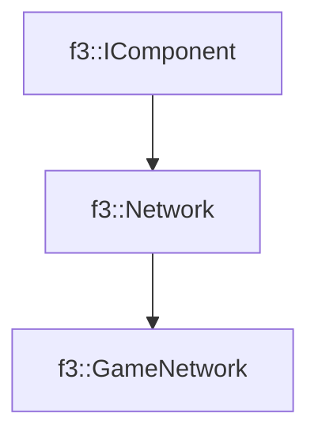

# f3::GameNetwork

[Return to `f3`](/docs/f3.md)

## C++

- [`GameNetwork.hpp`](/src/f3/GameNetwork.hpp)
- [`GameNetwork.cpp`](/src/f3/GameNetwork.cpp)

## References

- [`f3::IComponent`](/docs/f3/IComponent.md)
- [`f3::Network`](/docs/f3/Network.md)

## Inheritance

[Return to `f3`](/docs/f3.md)