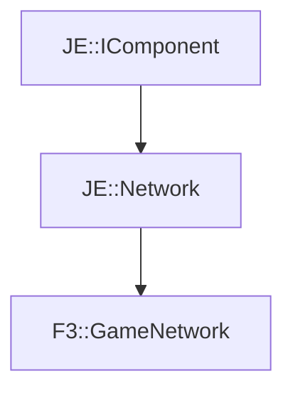

# F3::GameNetwork

[Return to `F3`](/docs/f3.md)

## C++

- [`GameNetwork.hpp`](/src/f3/GameNetwork.hpp)
- [`GameNetwork.cpp`](/src/f3/GameNetwork.cpp)

## References

- [`JE::IComponent`](https://github.com/OpenJE/openje/docs/je/IComponent.md)
- [`JE::Network`](https://github.com/OpenJE/openje/docs/je/Network.md)

## Inheritance

[Return to `F3`](/docs/f3.md)