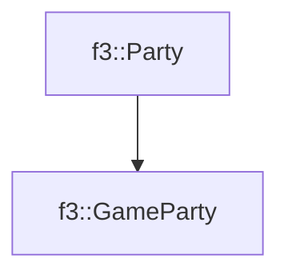

# f3::GameParty

[Return to `f3`](/docs/f3.md)

## C++

- [`GameParty.hpp`](/src/f3/GameParty.hpp)
- [`GameParty.cpp`](/src/f3/GameParty.cpp)

## References

- [`f3::Party`](/docs/f3/Party.md)

## Inheritance

[Return to `f3`](/docs/f3.md)