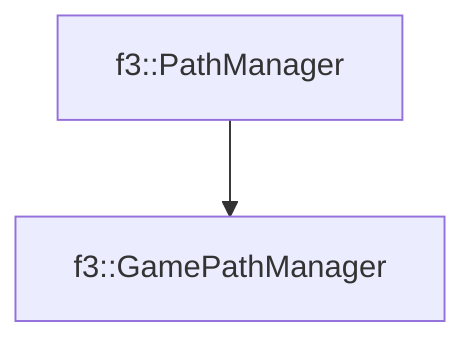

# f3::GamePathManager

[Return to `f3`](/docs/f3.md)

## C++

- [`GamePathManager.hpp`](/c++/include/GamePathManager.hpp)
- [`GamePathManager.cpp`](/c++/source/GamePathManager.cpp)

## References

- [`f3::PathManager`](/docs/f3/PathManager.md)

## Inheritance

[Return to `f3`](/docs/f3.md)