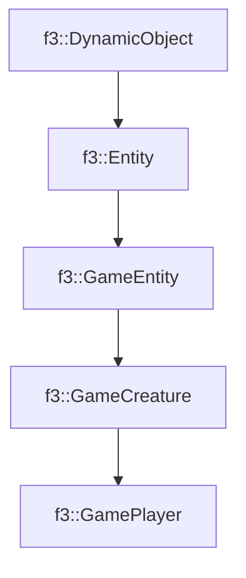

# f3::GamePlayer

[Return to `f3`](/docs/f3.md)

## C++

- [`GamePlayer.hpp`](/c++/include/GamePlayer.hpp)
- [`GamePlayer.cpp`](/c++/source/GamePlayer.cpp)

## References

- [`f3::DynamicObject`](/docs/f3/DynamicObject.md)
- [`f3::Entity`](/docs/f3/Entity.md)
- [`f3::GameEntity`](/docs/f3/GameEntity.md)
- [`f3::GameCreature`](/docs/f3/GameCreature.md)

## Inheritance

[Return to `f3`](/docs/f3.md)