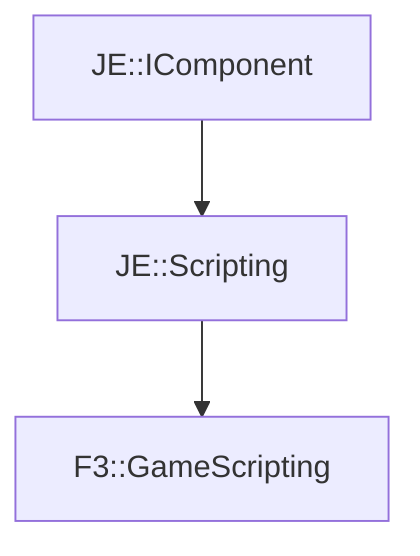

# F3::GameScripting

[Return to `F3`](/docs/f3.md)

## C++

- [`GameScripting.hpp`](/src/f3/GameScripting.hpp)
- [`GameScripting.cpp`](/src/f3/GameScripting.cpp)

## References

- [`JE::IComponent`](https://github.com/OpenJE/openje/docs/je/IComponent.md)
- [`JE::Scripting`](https://github.com/OpenJE/openje/docs/je/Scripting.md)

## Inheritance

[Return to `F3`](/docs/f3.md)