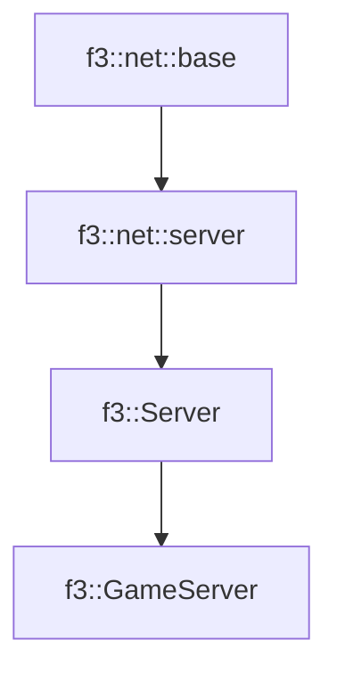

# f3::GameServer

[Return to `f3`](/docs/f3.md)

## C++

- [`GameServer.hpp`](/c++/include/GameServer.hpp)
- [`GameServer.cpp`](/c++/source/GameServer.cpp)

## References

- [`f3::net::base`](/docs/net/base.md)
- [`f3::net::server`](/docs/net/server.md)
- [`f3::Server`](/docs/f3/Server.md)

## Inheritance

[Return to `f3`](/docs/f3.md)