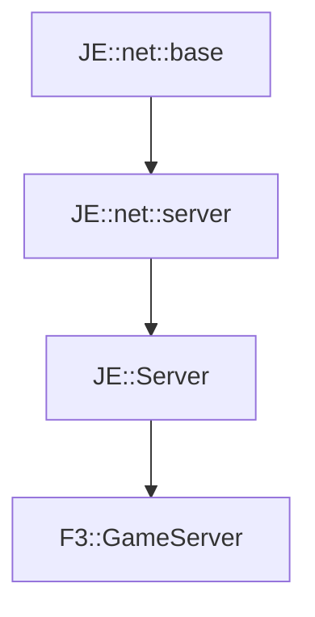

# F3::GameServer

[Return to `F3`](/docs/f3.md)

## C++

- [`GameServer.hpp`](/src/f3/GameServer.hpp)
- [`GameServer.cpp`](/src/f3/GameServer.cpp)

## References

- [`JE::net::base`](https://github.com/OpenJE/openje/docs/je/net/base.md)
- [`JE::net::server`](https://github.com/OpenJE/openje/docs/je/net/server.md)
- [`JE::Server`](https://github.com/OpenJE/openje/docs/je/Server.md)

## Inheritance

[Return to `F3`](/docs/f3.md)