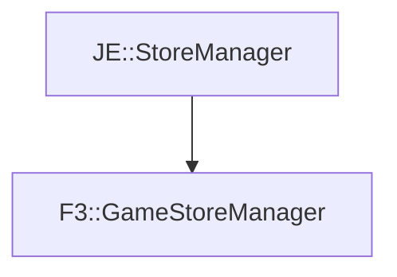

# F3::GameStoreManager

[Return to `F3`](/docs/f3.md)

## C++

- [`GameStoreManager.hpp`](/src/f3/GameStoreManager.hpp)
- [`GameStoreManager.cpp`](/src/f3/GameStoreManager.cpp)

## References

- [`JE::StoreManager`](https://github.com/OpenJE/openje/docs/je/StoreManager.md)

## Inheritance

[Return to `F3`](/docs/f3.md)