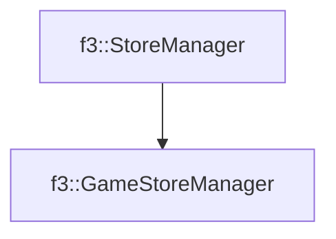

# f3::GameStoreManager

[Return to `f3`](/docs/f3.md)

## C++

- [`GameStoreManager.hpp`](/src/f3/GameStoreManager.hpp)
- [`GameStoreManager.cpp`](/src/f3/GameStoreManager.cpp)

## References

- [`f3::StoreManager`](/docs/f3/StoreManager.md)

## Inheritance

[Return to `f3`](/docs/f3.md)