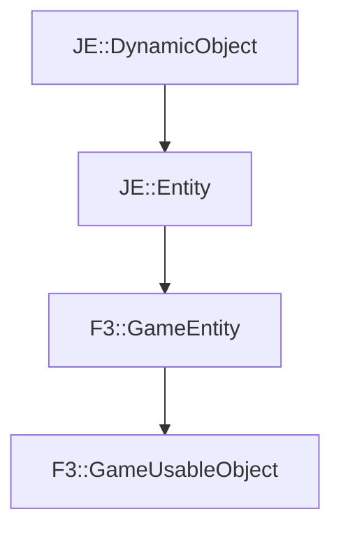

# F3::GameUsableObject

[Return to `F3`](/docs/f3.md)

## C++

- [`GameUsableObject.hpp`](/src/f3/GameUsableObject.hpp)
- [`GameUsableObject.cpp`](/src/f3/GameUsableObject.cpp)

## References

- [`F3::DynamicObject`](https://github.com/OpenJE/openje/docs/je/DynamicObject.md)
- [`F3::Entity`](https://github.com/OpenJE/openje/docs/je/Entity.md)
- [`F3::GameEntity`](/docs/f3/GameEntity.md)

## Inheritance

[Return to `F3`](/docs/f3.md)