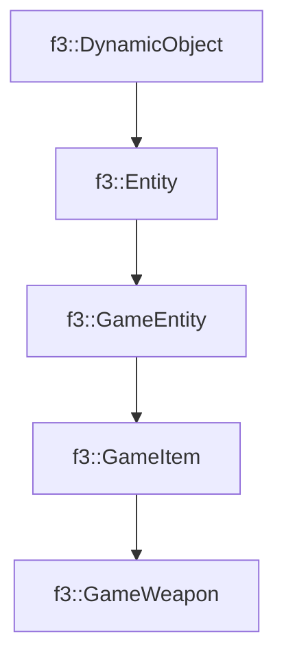

# f3::GameWeapon

[Return to `f3`](/docs/f3.md)

## C++

- [`GameWeapon.hpp`](/c++/include/GameWeapon.hpp)
- [`GameWeapon.cpp`](/c++/source/GameWeapon.cpp)

## References

- [`f3::DynamicObject`](/docs/f3/DynamicObject.md)
- [`f3::Entity`](/docs/f3/Entity.md)
- [`f3::GameEntity`](/docs/f3/GameEntity.md)
- [`f3::GameItem`](/docs/f3/GameItem.md)

## Inheritance

[Return to `f3`](/docs/f3.md)