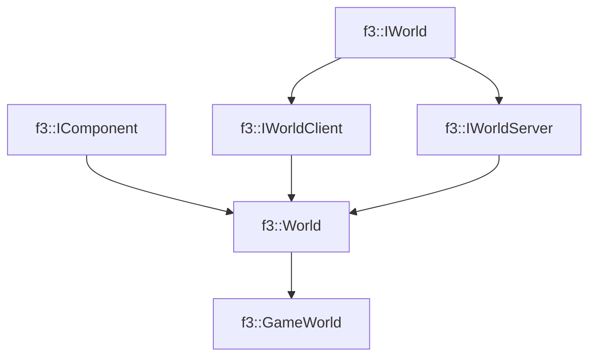

# f3::GameWorld

[Return to `f3`](/docs/f3.md)

## C++

- [`GameWorld.hpp`](/src/f3/GameWorld.hpp)
- [`GameWorld.cpp`](/src/f3/GameWorld.cpp)

## References

- [`f3::IWorld`](/docs/f3/IWorld.md)
- [`f3::IComponent`](/docs/f3/IComponent.md)
- [`f3::IWorldClient`](/docs/f3/IWorldClient.md)
- [`f3::IWorldServer`](/docs/f3/IWorldServer.md)
- [`f3::World`](/docs/f3/World.md)

## Inheritance

[Return to `f3`](/docs/f3.md)