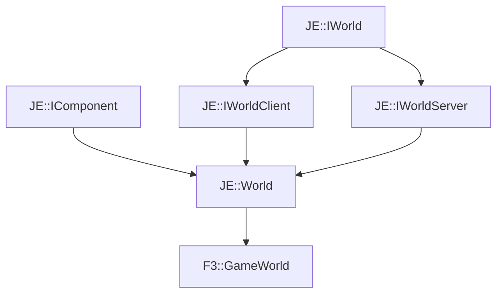

# F3::GameWorld

[Return to `F3`](/docs/f3.md)

## C++

- [`GameWorld.hpp`](/src/f3/GameWorld.hpp)
- [`GameWorld.cpp`](/src/f3/GameWorld.cpp)

## References

- [`JE::IWorld`](https://github.com/OpenJE/openje/docs/je/IWorld.md)
- [`JE::IComponent`](https://github.com/OpenJE/openje/docs/je/IComponent.md)
- [`JE::IWorldClient`](https://github.com/OpenJE/openje/docs/je/IWorldClient.md)
- [`JE::IWorldServer`](https://github.com/OpenJE/openje/docs/je/IWorldServer.md)
- [`JE::World`](https://github.com/OpenJE/openje/docs/je/World.md)

## Inheritance

[Return to `F3`](/docs/f3.md)