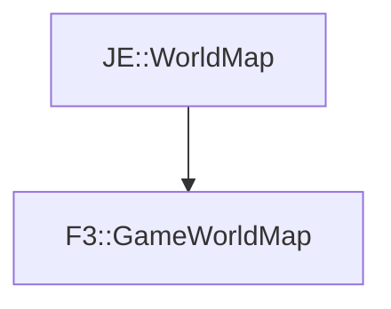

# F3::GameWorldMap

[Return to `F3`](/docs/f3.md)

## C++

- [`GameWorldMap.hpp`](/src/f3/GameWorldMap.hpp)
- [`GameWorldMap.cpp`](/src/f3/GameWorldMap.cpp)

## References

- [`JE::WorldMap`](https://github.com/OpenJE/openje/docs/je/WorldMap.md)

## Inheritance

[Return to `F3`](/docs/f3.md)