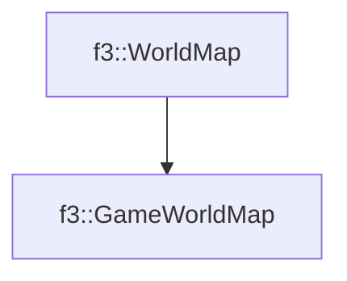

# f3::GameWorldMap

[Return to `f3`](/docs/f3.md)

## C++

- [`GameWorldMap.hpp`](/c++/include/GameWorldMap.hpp)
- [`GameWorldMap.cpp`](/c++/source/GameWorldMap.cpp)

## References

- [`f3::WorldMap`](/docs/f3/WorldMap.md)

## Inheritance

[Return to `f3`](/docs/f3.md)