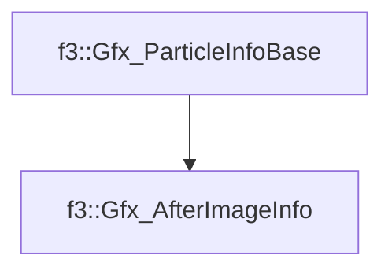

# f3::Gfx_AfterImageInfo

[Return to `f3`](/docs/f3.md)

## C++

- [`Gfx_AfterImageInfo.hpp`](/src/f3/Gfx_AfterImageInfo.hpp)
- [`Gfx_AfterImageInfo.cpp`](/src/f3/Gfx_AfterImageInfo.cpp)

## References

- [`f3::Gfx_ParticleInfoBase`](/docs/f3/Gfx_ParticleInfoBase.md)

## Inheritance

[Return to `f3`](/docs/f3.md)