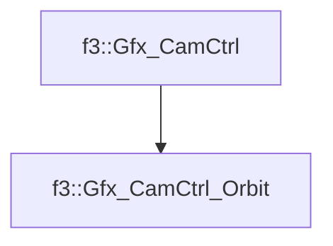

# f3::Gfx_CamCtrl_Orbit

[Return to `f3`](/docs/f3.md)

## C++

- [`Gfx_CamCtrl_Orbit.hpp`](/src/f3/Gfx_CamCtrl_Orbit.hpp)
- [`Gfx_CamCtrl_Orbit.cpp`](/src/f3/Gfx_CamCtrl_Orbit.cpp)

## References

- [`f3::Gfx_CamCtrl`](/docs/f3/Gfx_CamCtrl.md)

## Inheritance

[Return to `f3`](/docs/f3.md)