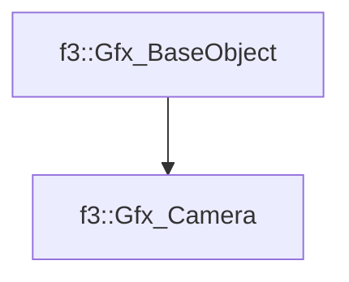

# f3::Gfx_Camera

[Return to `f3`](/docs/f3.md)

## C++

- [`Gfx_Camera.hpp`](/src/f3/Gfx_Camera.hpp)
- [`Gfx_Camera.cpp`](/src/f3/Gfx_Camera.cpp)

## References

- [`f3::Gfx_BaseObject`](/docs/f3/Gfx_BaseObject.md)

## Inheritance

[Return to `f3`](/docs/f3.md)