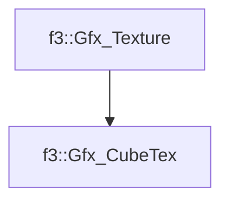

# f3::Gfx_CubeTex

[Return to `f3`](/docs/f3.md)

## C++

- [`Gfx_CubeTex.hpp`](/src/f3/Gfx_CubeTex.hpp)
- [`Gfx_CubeTex.cpp`](/src/f3/Gfx_CubeTex.cpp)

## References

- [`f3::Gfx_Texture`](/docs/f3/Gfx_Texture.md)

## Inheritance

[Return to `f3`](/docs/f3.md)