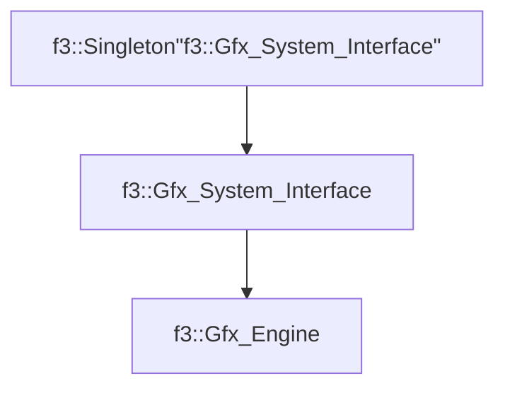

# f3::Gfx_Engine

[Return to `f3`](/docs/f3.md)

## C++

- [`Gfx_Engine.hpp`](/src/f3/Gfx_Engine.hpp)
- [`Gfx_Engine.cpp`](/src/f3/Gfx_Engine.cpp)

## References

- [`f3::Singleton`](/docs/f3/Singleton.md)
- [`f3::Gfx_System_Interface`](/docs/f3/Gfx_System_Interface.md)

## Inheritance

[Return to `f3`](/docs/f3.md)