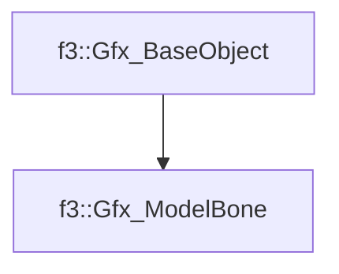

# f3::Gfx_ModelBone

[Return to `f3`](/docs/f3.md)

## C++

- [`Gfx_ModelBone.hpp`](/c++/include/Gfx_ModelBone.hpp)
- [`Gfx_ModelBone.cpp`](/c++/source/Gfx_ModelBone.cpp)

## References

- [`f3::Gfx_BaseObject`](/docs/f3/Gfx_BaseObject.md)

## Inheritance

[Return to `f3`](/docs/f3.md)